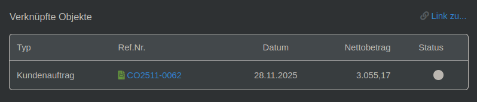
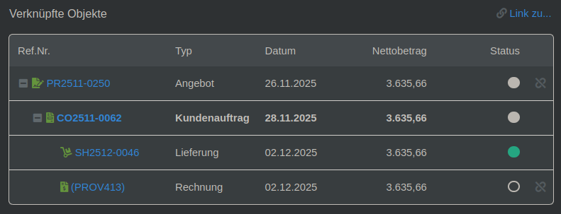

# Linked Object Tree Module for Dolibarr

## Overview

This module enhances Dolibarr's linked objects display by replacing the default flat list with an interactive tree visualization. It shows the complete hierarchy of related documents (invoices, orders, proposals, shipments, etc.) with the current object highlighted in context.

## Screenshots

### Before: Classic Flat List

*The standard Dolibarr linked objects display shows a simple flat list of related documents.*

### After: Interactive Tree View

*The enhanced view displays all linked objects in a hierarchical tree structure with expand/collapse functionality and current object highlighting.*

## Features

- **Complete Tree View**: Displays all linked objects in a hierarchical tree structure
- **Current Object Highlighting**: The current document is highlighted within the tree
- **Interactive Collapse/Expand**: Click +/- buttons to collapse or expand branches
- **Multi-Root Support**: Handles documents with multiple parent chains
- **Circular Reference Detection**: Prevents infinite loops in complex relationships
- **Configurable Depth**: Set maximum tree traversal depth to control performance
- **Responsive Design**: Works well on desktop and mobile devices
- **Print-Friendly**: Optimized for printing with all nodes expanded

## Installation

1. Copy the `linkedobjecttree` directory to `htdocs/custom/`
2. Log in to Dolibarr as administrator
3. Go to Home → Setup → Modules/Applications
4. Find "Linked Object Tree" in the module list
5. Click "Activate" to enable the module

## Configuration

After activation, go to Home → Setup → Modules/Applications → Linked Object Tree settings.

**Available Settings:**

- **Maximum Tree Depth**: Set how many levels deep to traverse (1-50, default: 10)

## Supported Object Types

The module supports the following Dolibarr objects:

- Invoices (Customer & Supplier)
- Orders (Customer & Supplier)
- Proposals (Customer & Supplier)
- Shipments/Expeditions
- Deliveries
- Contracts
- Interventions
- Tickets
- Projects & Tasks
- Manufacturing Orders (MRP)
- Bills of Materials (BOM)

## How It Works

### Tree Building Algorithm

1. **Find Roots**: Starting from the current object, traverse upward to find all root objects (those with no parents)
2. **Build Tree**: From each root, recursively build the tree downward, including all children
3. **Highlight Current**: Mark the current object in the tree for easy identification
4. **Render HTML**: Generate interactive HTML with expand/collapse functionality

### Hook Integration

The module uses Dolibarr's `showLinkedObjectBlock` hook to intercept and replace the standard linked objects display. This ensures seamless integration without modifying core files.

## License

This program is free software: you can redistribute it and/or modify it under the terms of the GNU General Public License as published by the Free Software Foundation, either version 3 of the License, or (at your option) any later version.
